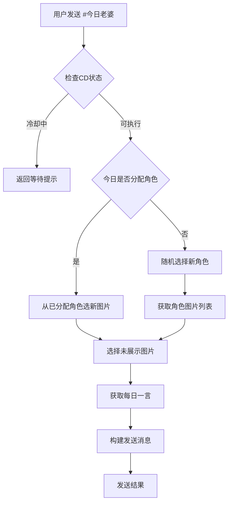

# 🌸 今日老婆插件 (Daily Waifu)

> *可以的话请给个star吧~*  
> *高中生 如果出bug 请提issues 一般周六晚上才能修~*

如果你不想部署，可以直接使用现成的 --- **青弋Bot官网 fannet.asia**

> 适用于 Trss-Yunzai 的趣味角色扮演插件  
> 每天为你随机分配专属二次元角色，附赠优美每日一言

---

## ✨ 功能特色

| 功能 | 描述 |
|------|------|
| 🎯 **个人专属** | 每个用户每天固定一位角色 |
| 🖼️ **多样展示** | 同一天内可看到同一角色的不同照片 |
| 💌 **每日一言** | 每次附带优美名言佳句 |
| ⏳ **智能冷却** | 3秒个人冷却时间 |
| 👥 **群聊友好** | 自动艾特，体验流畅 |


---

## 📦 安装方法

### 1. 下载插件
将 `daily-waifu.js` 文件下载到机器人插件目录：
```
Yunzai-Bot/plugins/daily-waifu/daily-waifu.js
```

### 2. 下载素材
**下载地址**：个人网盘【custom_role_pile.7z】  
**链接**：https://s.fnnas.net/s/72f99080f59d42d494  
**密码**：`daily-waifu`

**其他网盘**：123网盘  
**链接**：https://www.123865.com/s/7BPvTd-V85W?pwd=qybt#  
**提取码**：qybt

将解压后的 `custom_role_pile` 文件夹放在：
```
Yunzai-Bot/plugins/daily-waifu/custom_role_pile/
```

### 3. 重启机器人
```bash
# 在 Yunzai-Bot 目录下执行
npm run stop
npm run start
```

---

## 📁 目录结构

安装后确保目录结构如下：
```
Yunzai-Bot/plugins/
└── daily-waifu/
    ├── daily-waifu.js          # 插件主文件
    └── custom_role_pile/       # 角色素材目录
        ├── 1011/
        │   ├── 长离_001.jpg
        │   ├── 长离_002.jpg
        │   └── ...
        ├── 1012/
        │   ├── 白露_001.jpg
        │   └── ...
        └── ...
```

**文件命名规范**：
- 文件夹编号对应角色
- 文件格式：`角色名_编号.jpg`
- 支持格式：JPG、JPEG、PNG、GIF

---

## 🎮 使用方式

在群聊或私聊中发送：
```
#今日老婆
```

### 💬 响应示例
```
@用户昵称 
🌸 今日缘分已为你准备妥当！
✨ 今日老婆：长离
[长离的图片]

📝 每日一言：
💫 愿你眼中总有光芒，活成你想要的模样
   —— 《网络》
```

---

## ⚙️ 核心逻辑

### 🔄 工作流程


### 🎯 特色机制

- **用户识别**：基于用户ID，群聊私聊身份一致
- **角色固定**：每日随机分配，当天内保持同一角色
- **图片轮播**：自动记录展示历史，避免重复
- **智能缓存**：用户级缓存 + CD控制
- **容错处理**：多级错误处理，保证稳定性

---

## ❓ 常见问题

### Q: 插件没有响应怎么办？
**A:** 检查插件文件位置是否正确，然后重启机器人

### Q: 图片发送失败？
**A:** 检查素材文件是否完整，路径是否正确

### Q: 每日一言不显示？
**A:** API暂时不可用，不影响主要功能

### Q: 如何添加更多角色？
**A:** 按照目录结构在 `custom_role_pile` 下创建新文件夹即可

---

## 📝 更新日志

### v1.0 - 初始版本
- ✅ 基础角色分配功能
- ✅ 每日一言集成
- ✅ 智能冷却系统
- ✅ 多环境适配（群聊/私聊）

---

## 💫 结语

> *让每天的聊天都有一点小惊喜*  
> *仅用4h完成此插件，这何尝不是一种摸鱼~*

---

**标签**: `#Trss-Yunzai` `#二次元` `#角色扮演` `#趣味插件`

**开发者**: 高中生开发者，周末维护  
**反馈**: 如有问题请提交 Issues，一般周六晚上修复
