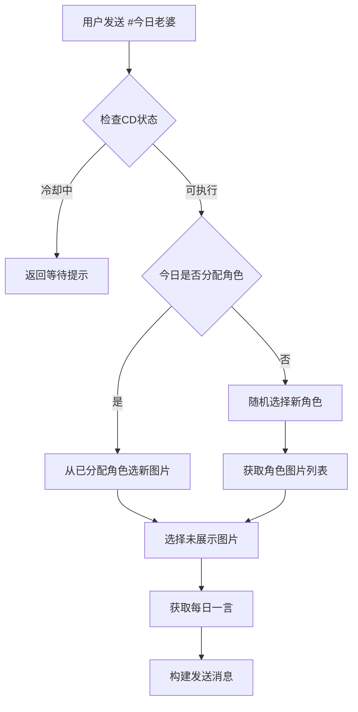

# 🌸 今日老婆插件 (Daily Waifu)

> 适用于 Trss-Yunzai 的趣味角色扮演插件  
> 每天为你随机分配专属二次元角色，附赠优美每日一言

---

## ✨ 功能特色

| 功能 | 描述 |
|------|------|
| 🎯 **个人专属** | 每个用户每天固定一位角色 |
| 🖼️ **多样展示** | 同一天内可看到同一角色的不同照片 |
| 💌 **每日一言** | 每次附带优美名言佳句 |
| ⏳ **智能冷却** | 3秒个人冷却时间 |
| 👥 **群聊友好** | 自动艾特，体验流畅 |


---

## 📦 安装方法

### 1. 插件安装
将 `daily-waifu.js` 插件文件放置到机器人插件目录

### 2. 依赖安装
```bash
npm install node-fetch
```
*使用脚本安装无需执行此步*

### 3. 素材下载
**下载地址**：个人网盘【custom_role_pile.7z】  
**链接**：https://s.fnnas.net/s/72f99080f59d42d494  
**密码**：`daily-waifu`
**其他网盘**: 123网盘 链接：https://www.123865.com/s/7BPvTd-V85W?pwd=qybt#  提取码：qybt
---

## 📁 目录结构

解压后确保目录结构如下：
```
plugins/daily-waifu/
├── daily-waifu.js          # 插件主文件
└── custom_role_pile/       # 角色素材目录
    ├── 1011/
    │   ├── 长离_001.jpg
    │   ├── 长离_002.jpg
    │   └── ...
    ├── 1012/
    │   ├── 白露_001.jpg
    │   └── ...
    └── ...
```

**文件命名规范**：
- 文件夹编号对应角色
- 文件格式：`角色名_编号.jpg`

---

## 🎮 使用方式

在群聊或私聊中发送：
```
#今日老婆
```

---

## ⚙️ 核心逻辑

### 🔄 工作流程


### 🎯 特色机制

- **用户识别**：基于用户ID，群聊私聊身份一致
- **角色固定**：每日随机分配，当天内保持同一角色
- **图片轮播**：自动记录展示历史，避免重复
- **智能缓存**：用户级缓存 + CD控制
- **容错处理**：多级错误处理，保证稳定性

---

## ⚠️ 注意事项

1. 每个用户每天首次使用随机分配角色
2. 同一天内重复使用展示同一角色的不同图片
3. 素材需自行从网盘下载，插件不包含图片文件
4. 确保网络通畅以获取每日一言

---

## 📝 更新日志

### v1.0 - 初始版本
- ✅ 基础角色分配功能
- ✅ 每日一言集成
- ✅ 智能冷却系统
- ✅ 多环境适配（群聊/私聊）

---

## 💫 结语

> *让每天的聊天都有一点小惊喜*  
> *仅用4h完成此插件，这何尝不是一种摸鱼~*

---

**标签**：`#Trss-Yunzai` `#二次元` `#角色扮演` `#趣味插件`
